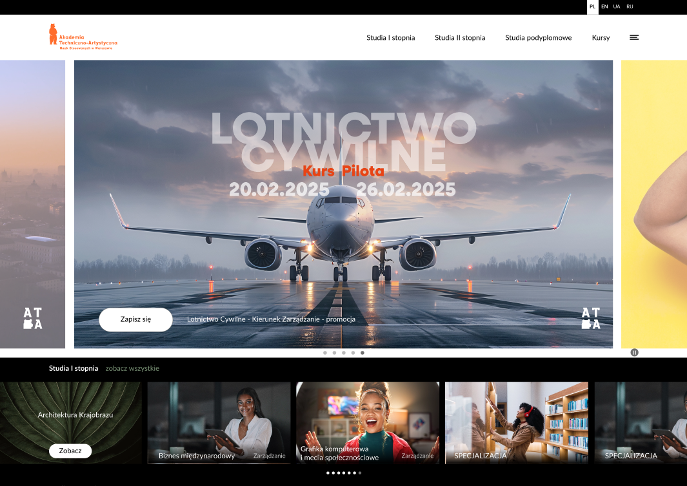

# Akademiata 
#### Contributors: Avista Consulting & Management  
#### Author: Avista Consulting & Management  
#### Author URI: https://avistacm.com/  
#### Tags: custom, responsive, modern, slick-slider, sass, gulp, webpack
#### License: GNU General Public License v2 or later  
#### License URI: https://www.gnu.org/licenses/gpl-2.0.html

# Akademiata is a custom WordPress theme developed by Avista Consulting & Management.

## Requirements

* [Node](https://nodejs.org/)
* [Gulp](https://gulpjs.com/docs/en/getting-started/quick-start)
* 
## Usage

First, clone this repository in your WordPress themes directory.

Then, run the following commands in the theme's directory :

	npm install

Launch your watch for assets with - npx webpack && gulp :

	npm run build

Launch your watch for assets with :

	npm run start

Launch your watch for assets with :

	npx webpack
 

Remove node_modules for PowerShell:

	Remove-Item -Recurse -Force node_modules 

Remove  package-lock.json for PowerShell:

    Remove-Item package-lock.json 

### phpshtorm deployment :

    ftp/sftp
    mappings
    excluded paths
    upload to server
    option save always or ctrl+s or never

# License & Credits 
Akademiata is licensed under the **GNU General Public License v2 or later**.  
You can modify and distribute it under the GPL.

**Third-Party Libraries Used:**
- [Slick Slider](https://kenwheeler.github.io/slick/) – MIT License
- [Bootstrap (if used)](https://getbootstrap.com/) – MIT License

For full details, see **LICENSE.txt** in the theme folder.
